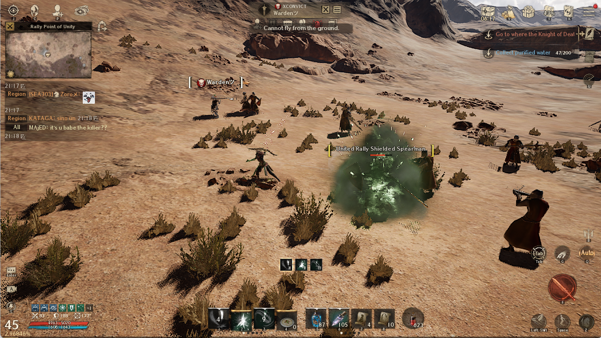
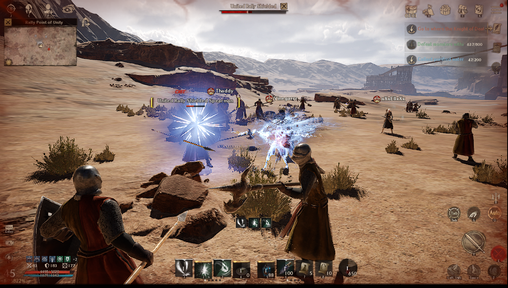

# Auto Detect Image

**Auto Detect Image** is a screen scanning application designed to detect image events in real-time. When an event is detected, the application automatically presses the key specified by the user. In this repo, Auto Detect Image is used for NightCrows to detect player attacks and press 'Base-return scroll' when an attack is detected.

## Features

**Image Detection**: Uses OpenCV to detect images on the screen. When an image is detected, it automatically presses the specified key.

**Sending Discord Notifications**: When an image is detected, a notification is sent to Discord, including information about the detected object and a screenshot of the detected object.

## Tutorial for NightCrows

This is a GUI application.

1. **Choose a Window**: Select a window from the combobox.

2. **Choose the Image to Detect**: If you don’t have an image, you can download `attack-icon.png` from the resource folder.

3. **Click 'Listen'**: Press your shortcut key for "Base-return scroll".

4. **(Optional) Provide a Discord Webhook Link**: This allows you to receive notifications on Discord.

5. **Click 'Start'**: Begin the image detection process.

**Note**: This application is under development for additional functionality and may encounter errors. Currently, it can detect attacks and handle the return of villagers through the "Base-return scroll."

This is normal status of character:

This is detected attack_icon image:

## Future Development

**Multiple Windows Management**: Manage multiple devices using an Android emulator and proxy.

**Auto Move to Location**: After relocating to the village, select saved zones for farming.

## Bugs and Questions

Please submit any issues or questions through the GitHub Issues page.